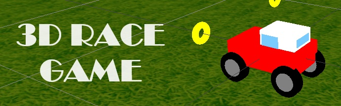
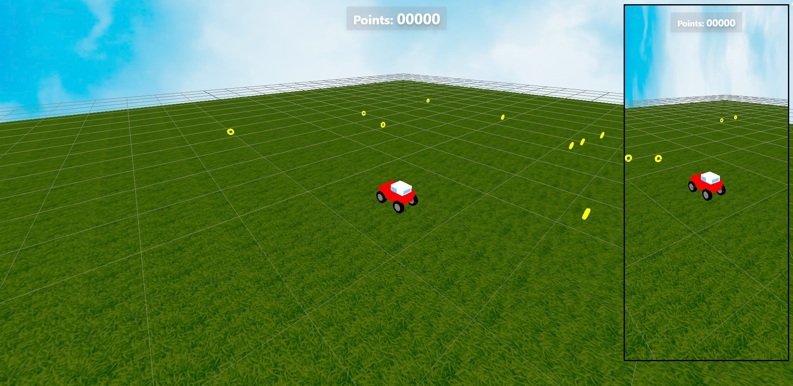

<p align="center">
    
</p>

<h1 align="center">3D Race Game</h1>
<p align="center">Wanna have some fun? Come on & let's play this game!</p>

<p align="center">:construction: Application in progress :construction:</p>

## Technologies :gear:

Used technologies:

- Three.js
- Vanilla JavaScript
- Tailwind CSS

Project was created with tool:

- Vite

## Getting Started :checkered_flag:

First, install all dependencies:

```bash
npm i
```

Second, run the development server:

```bash
npm run dev
```

## Live link :tv:

https://goldipl.github.io/3D-race-game/

## Screenshots


